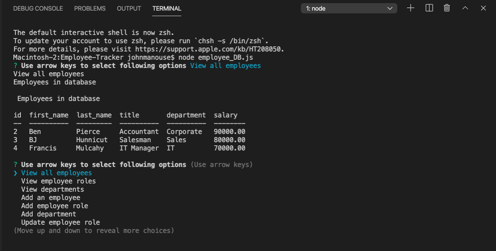

<h1>Employee Tracker</h1>
<h2>John Manouse</h2>

I created a  Content Management System that will allow a user to view, add, update, or delete employees information in a mysql database. The user will use a node command line interface(CLI) that will prompt the user to choose an action to add, or update an employee's information, including their roles, or departments in the company. The user will input information via the terminal following the prompts. This will allow the user to control the information saved to a database. The link below will provide you with a short video on how the application works.

 
<h2>Employee Tracker</h2>
<ul>
    <li>HTML code</li>
    <li>CSS</li>
    <li>Javascript</li>
    <li>node.js</li>
    <li>mysql</li>
</ul>

<h2>Pull Requests welcome for contribution</h2>

John Manouse

Video Link: <a href="https://XXX">Employee Tracker Video</a>

Github: <a href="https://github.com/Mirageg4/Employee-Tracker">Employee-Tracker</a>

              

License: Project is licensed under the MIT License. 
See <a href ="LICENSE.md">LICENSE</a> file for details.

